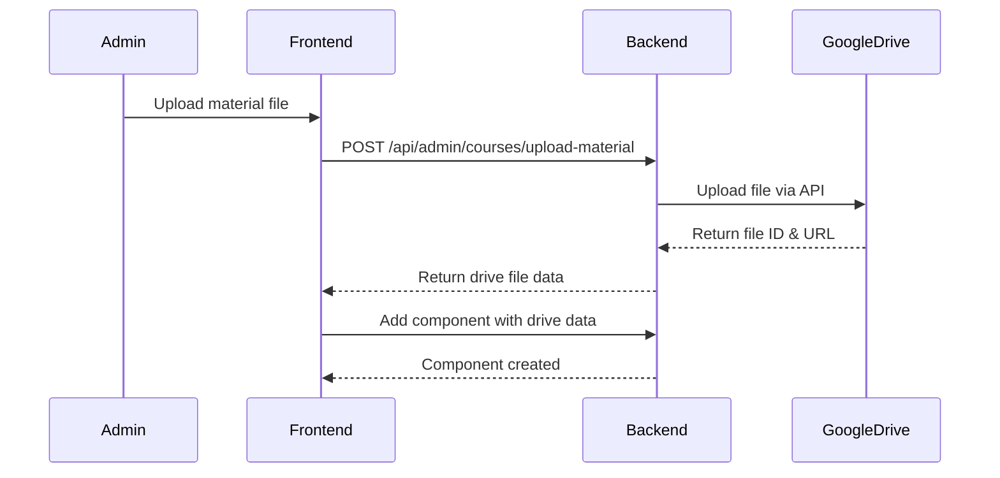

# Google Drive Integration for Learning Materials

## Overview
The EHS E-Learning Platform will use Google Drive to store and manage all learning materials (PDFs, videos, and presentations). This integration provides:
- Scalable cloud storage
- Direct streaming for videos
- Reliable file access
- Reduced server storage costs

## Implementation Approach

### 1. Google Drive API Setup
```yaml
Required Google APIs:
- Google Drive API v3
- Google OAuth 2.0

Service Account:
- Create service account in Google Cloud Console
- Download credentials JSON file
- Store securely in application properties

Permissions:
- Drive file upload
- Drive file read
- Drive sharing management
```

### 2. Backend Configuration

#### Application Properties
```properties
# Google Drive Configuration
google.drive.service-account-key-path=/path/to/credentials.json
google.drive.folder-id=<parent-folder-id>
google.drive.enable-sharing=true
```

#### Google Drive Service
```java
@Service
public class GoogleDriveService {
    
    private Drive driveService;
    private String parentFolderId;
    
    @PostConstruct
    public void init() throws IOException {
        // Initialize Google Drive service with service account
        GoogleCredentials credentials = GoogleCredentials
            .fromStream(new FileInputStream(serviceAccountKeyPath))
            .createScoped(Collections.singleton(DriveScopes.DRIVE));
            
        driveService = new Drive.Builder(
            GoogleNetHttpTransport.newTrustedTransport(),
            JacksonFactory.getDefaultInstance(),
            new HttpCredentialsAdapter(credentials))
            .setApplicationName("EHS E-Learning Platform")
            .build();
    }
    
    public DriveFileData uploadFile(MultipartFile file, String type) throws IOException {
        // Create file metadata
        File fileMetadata = new File();
        fileMetadata.setName(generateFileName(file.getOriginalFilename()));
        fileMetadata.setParents(Collections.singletonList(parentFolderId));
        
        // Upload file
        InputStreamContent mediaContent = new InputStreamContent(
            file.getContentType(), 
            file.getInputStream()
        );
        
        File uploadedFile = driveService.files().create(fileMetadata, mediaContent)
            .setFields("id, name, webViewLink, webContentLink, size")
            .execute();
            
        // Set sharing permissions
        Permission permission = new Permission();
        permission.setType("anyone");
        permission.setRole("reader");
        driveService.permissions().create(uploadedFile.getId(), permission).execute();
        
        return new DriveFileData(
            uploadedFile.getId(),
            uploadedFile.getWebViewLink(),
            uploadedFile.getName(),
            uploadedFile.getSize()
        );
    }
    
    public void deleteFile(String fileId) throws IOException {
        driveService.files().delete(fileId).execute();
    }
}
```

### 3. Updated Course Component Model

```java
@Entity
@Table(name = "course_components")
public class CourseComponent {
    // ... existing fields ...
    
    @Column(columnDefinition = "TEXT")
    private String data; // JSON data including Google Drive info
    
    // Data structure for materials:
    // {
    //   "title": "Introduction to Safety",
    //   "type": "PDF",
    //   "driveFileId": "1abc123...",
    //   "driveFileUrl": "https://drive.google.com/...",
    //   "fileName": "safety-intro.pdf",
    //   "fileSize": 1048576,
    //   "duration": null
    // }
}
```

### 4. Material Upload Flow



### 5. Frontend Implementation

#### Material Upload Component
```javascript
const MaterialUpload = ({ onUpload }) => {
  const [uploading, setUploading] = useState(false);
  
  const handleFileUpload = async (event) => {
    const file = event.target.files[0];
    if (!file) return;
    
    setUploading(true);
    const formData = new FormData();
    formData.append('file', file);
    formData.append('type', getFileType(file));
    
    try {
      const response = await api.post('/admin/courses/upload-material', formData, {
        headers: { 'Content-Type': 'multipart/form-data' }
      });
      
      onUpload({
        title: file.name,
        type: getFileType(file),
        driveFileId: response.data.driveFileId,
        driveFileUrl: response.data.driveFileUrl,
        fileName: response.data.fileName,
        fileSize: response.data.fileSize
      });
    } catch (error) {
      console.error('Upload failed:', error);
    } finally {
      setUploading(false);
    }
  };
  
  return (
    <Box>
      <input
        type="file"
        accept=".pdf,.mp4,.ppt,.pptx"
        onChange={handleFileUpload}
        disabled={uploading}
      />
      {uploading && <CircularProgress />}
    </Box>
  );
};
```

#### Material Viewer Component
```javascript
const MaterialViewer = ({ material }) => {
  const { driveFileUrl, type, title } = material;
  
  if (type === 'VIDEO') {
    return (
      <video controls width="100%">
        <source src={driveFileUrl} />
      </video>
    );
  }
  
  if (type === 'PDF') {
    return (
      <iframe
        src={`${driveFileUrl}?embedded=true`}
        width="100%"
        height="600px"
        title={title}
      />
    );
  }
  
  // For PPT, provide download link
  return (
    <Box>
      <Typography>{title}</Typography>
      <Button
        href={driveFileUrl}
        target="_blank"
        rel="noopener noreferrer"
      >
        View Presentation
      </Button>
    </Box>
  );
};
```

### 6. Security Considerations

1. **Service Account Security**
   - Store credentials securely
   - Use environment variables
   - Never expose in frontend

2. **File Access Control**
   - Set appropriate sharing permissions
   - Track file access in database
   - Implement view permissions check

3. **File Type Validation**
   - Validate MIME types
   - Check file extensions
   - Limit file sizes

4. **Quota Management**
   - Monitor Drive storage usage
   - Implement file cleanup policies
   - Set per-user upload limits

### 7. Error Handling

```java
@ControllerAdvice
public class DriveExceptionHandler {
    
    @ExceptionHandler(GoogleJsonResponseException.class)
    public ResponseEntity<?> handleDriveError(GoogleJsonResponseException e) {
        if (e.getStatusCode() == 403) {
            return ResponseEntity.status(HttpStatus.FORBIDDEN)
                .body(new MessageResponse("Drive quota exceeded"));
        }
        if (e.getStatusCode() == 404) {
            return ResponseEntity.status(HttpStatus.NOT_FOUND)
                .body(new MessageResponse("File not found in Drive"));
        }
        return ResponseEntity.status(HttpStatus.INTERNAL_SERVER_ERROR)
            .body(new MessageResponse("Drive operation failed"));
    }
}
```

### 8. Migration from Local Storage

For existing files in the `uploads/` directory:

1. Create migration script to upload files to Drive
2. Update database records with Drive file IDs
3. Maintain backward compatibility during transition
4. Clean up local files after successful migration

### 9. Benefits

- **Scalability**: No server storage limitations
- **Performance**: Direct streaming from Google
- **Reliability**: Google's infrastructure
- **Cost-effective**: Reduced server costs
- **Features**: Built-in preview, sharing, versioning

### 10. Future Enhancements

- Implement Google Drive folder structure per course
- Add file versioning for course updates
- Enable collaborative editing for admins
- Implement bulk upload functionality
- Add automatic video transcoding