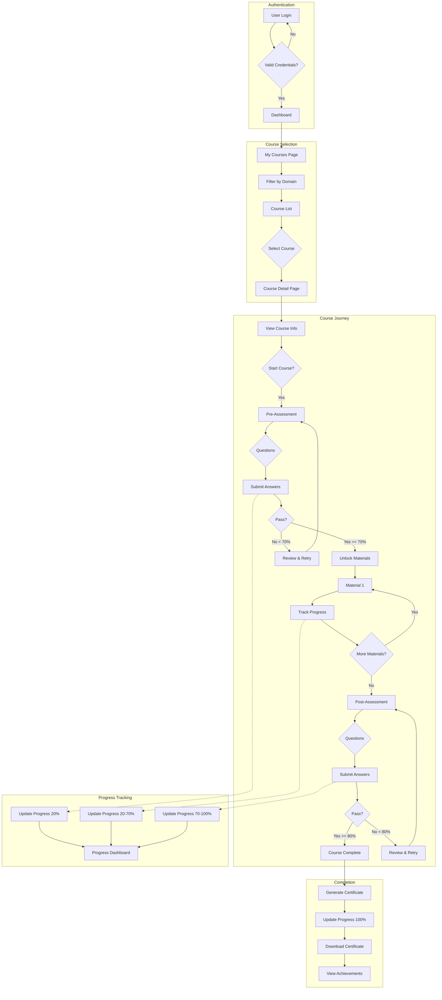
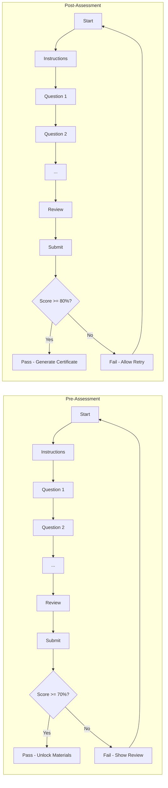
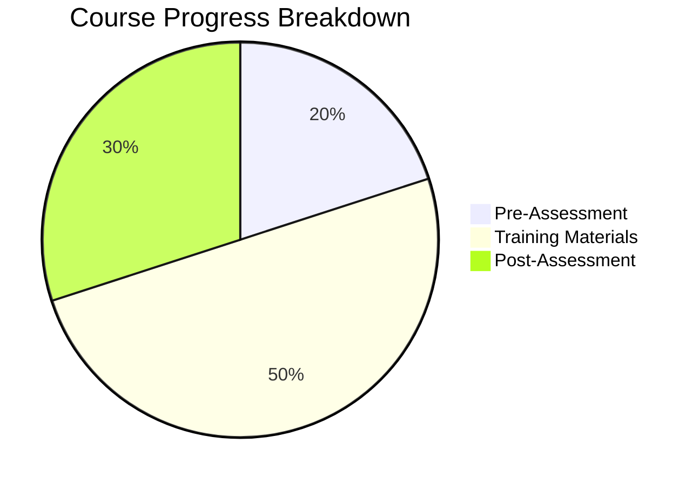
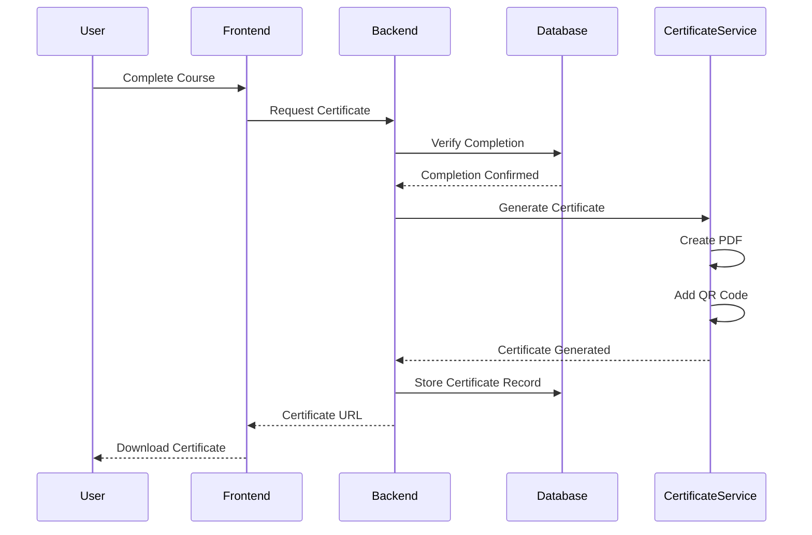
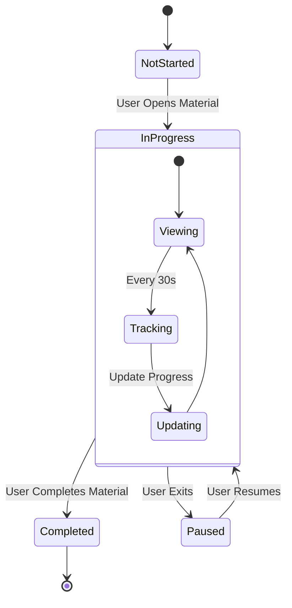
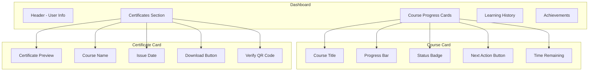

# User Experience Visual Diagram

## Complete Learning Journey Flow

## Assessment Flow Detail

## Progress Calculation Visual

## Certificate Generation Flow

## Material Tracking System

## User Dashboard Components

