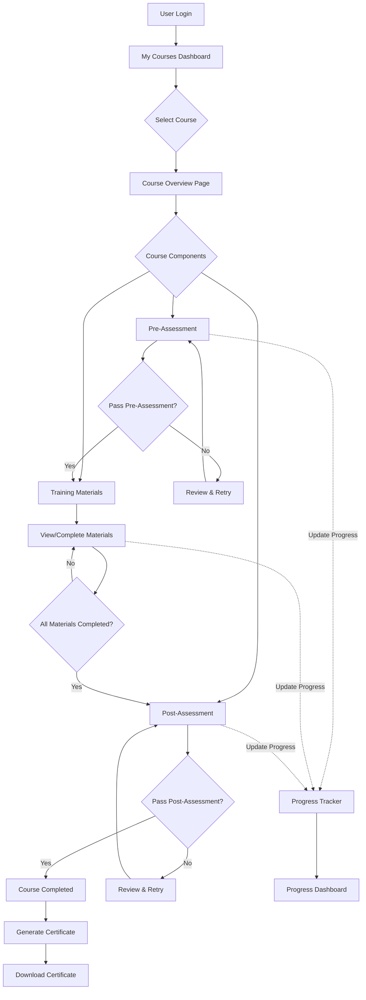

# User Learning Journey - EHS E-Learning Platform

## 1. User Learning Flow Diagram



## 2. Detailed User Experience Flow

### 2.1 Course Access Flow
1. **User logs in** → Redirected to Dashboard
2. **Navigates to "My Courses"** → Sees courses filtered by their domain
3. **Selects a course** → Course detail page opens
4. **Views course components** → Pre-assessment, Materials, Post-assessment

### 2.2 Assessment Experience

#### Pre-Assessment Flow:
```
User clicks "Start Pre-Assessment"
  ↓
Assessment Instructions Page
  ↓
Question 1 → Question 2 → ... → Question N
  ↓
Review Answers (Optional)
  ↓
Submit Assessment
  ↓
Show Results (Pass/Fail)
  ↓
If Pass: Unlock Materials
If Fail: Show Review Options
```

#### Post-Assessment Flow:
```
Similar to Pre-Assessment
  ↓
If Pass: Generate Certificate
If Fail: Allow Retry (with limits)
```

### 2.3 Material Viewing Experience
```
User clicks "View Material"
  ↓
Material Viewer Opens
  ↓
PDF Viewer / Video Player / Document Reader
  ↓
Track Time Spent / Completion
  ↓
Mark as Complete (Manual/Automatic)
  ↓
Update Progress
```

## 3. Progress Tracking System

### 3.1 Progress Components

```javascript
UserProgress {
  userId: UUID
  courseId: UUID
  startedAt: DateTime
  completedAt: DateTime
  overallProgress: 0-100%
  status: ENROLLED | IN_PROGRESS | COMPLETED
  certificateId: UUID (if completed)
}

ComponentProgress {
  userId: UUID
  courseId: UUID
  componentId: UUID
  componentType: PRE_ASSESSMENT | MATERIAL | POST_ASSESSMENT
  status: NOT_STARTED | IN_PROGRESS | COMPLETED | FAILED
  startedAt: DateTime
  completedAt: DateTime
  score: Number (for assessments)
  attempts: Number
  timeSpent: Duration
  lastAccessedAt: DateTime
}
```

### 3.2 Progress Calculation Formula

```
Overall Progress = Σ(Component Weight × Component Completion) / Total Weight

Where:
- Pre-Assessment Weight: 20%
- Materials Weight: 50%
- Post-Assessment Weight: 30%

Material Progress = (Completed Materials / Total Materials) × 100
```

### 3.3 Progress Tracking Implementation

#### Backend Models:
```java
// UserCourseProgress.java
@Entity
public class UserCourseProgress {
    @Id
    private UUID id;
    
    @ManyToOne
    private Users user;
    
    @ManyToOne
    private Course course;
    
    private Double overallProgress;
    private ProgressStatus status;
    private LocalDateTime startedAt;
    private LocalDateTime completedAt;
    private UUID certificateId;
}

// ComponentProgress.java
@Entity
public class ComponentProgress {
    @Id
    private UUID id;
    
    @ManyToOne
    private Users user;
    
    @ManyToOne
    private CourseComponent component;
    
    private ComponentStatus status;
    private Integer score;
    private Integer attempts;
    private Long timeSpentSeconds;
    private LocalDateTime lastAccessedAt;
}
```

## 4. Certificate Generation System

### 4.1 Certificate Requirements
- Course must be 100% complete
- Post-assessment must be passed
- All required components must be completed

### 4.2 Certificate Data Model
```java
@Entity
public class Certificate {
    @Id
    private UUID id;
    
    @ManyToOne
    private Users user;
    
    @ManyToOne
    private Course course;
    
    private String certificateNumber; // Unique identifier
    private LocalDateTime issuedDate;
    private LocalDateTime expiryDate; // If applicable
    private String verificationUrl; // For QR code verification
    private CertificateStatus status;
}
```

### 4.3 Certificate Template
```
==============================================
       CERTIFICATE OF COMPLETION
==============================================

This is to certify that

[USER NAME]

has successfully completed the course

[COURSE TITLE]

with a score of [SCORE]%

Issue Date: [DATE]
Certificate ID: [CERT-ID]
Valid Until: [EXPIRY DATE]

[QR CODE for verification]

Authorized by: [ADMIN NAME]
Organization: EHS Learning Platform
==============================================
```

## 5. Implementation Plan

### Phase 1: Progress Tracking Foundation
1. Create database models for progress tracking
2. Implement progress service layer
3. Add progress update endpoints
4. Create progress calculation logic

### Phase 2: Assessment System
1. Design assessment question models
2. Create assessment UI components
3. Implement scoring logic
4. Add retry limitations
5. Connect to progress tracking

### Phase 3: Material Tracking
1. Implement material viewer with tracking
2. Add time tracking for materials
3. Create completion detection
4. Update progress on material completion

### Phase 4: Certificate Generation
1. Design certificate template
2. Implement PDF generation
3. Add certificate storage
4. Create download endpoint
5. Add QR code verification

### Phase 5: User Dashboard
1. Create progress visualization
2. Add course status indicators
3. Implement certificate management
4. Create learning history view

## 6. API Endpoints

### Progress Tracking
```
GET /api/v2/user/progress/courses/{courseId} - Get course progress
POST /api/v2/user/progress/components/{componentId}/start - Start component
POST /api/v2/user/progress/components/{componentId}/complete - Complete component
PUT /api/v2/user/progress/components/{componentId}/update - Update progress
```

### Assessments
```
GET /api/v2/user/assessments/{assessmentId} - Get assessment questions
POST /api/v2/user/assessments/{assessmentId}/submit - Submit answers
GET /api/v2/user/assessments/{assessmentId}/results - Get results
```

### Certificates
```
GET /api/v2/user/certificates - List user certificates
GET /api/v2/user/certificates/{certificateId} - Get certificate details
GET /api/v2/user/certificates/{certificateId}/download - Download PDF
GET /api/v2/user/certificates/{certificateId}/verify - Verify certificate
```

## 7. User Interface Components

### 7.1 Course Progress Card
```jsx
<CourseProgressCard>
  - Course Title
  - Progress Bar (0-100%)
  - Status Badge (In Progress/Completed)
  - Next Action Button
  - Certificate Link (if completed)
</CourseProgressCard>
```

### 7.2 Assessment Interface
```jsx
<AssessmentView>
  - Question Display
  - Answer Options (Multiple Choice/True-False)
  - Progress Indicator (Question X of Y)
  - Timer (if applicable)
  - Submit Button
  - Review Screen
</AssessmentView>
```

### 7.3 Certificate View
```jsx
<CertificateView>
  - Certificate Preview
  - Download Button
  - Share Options
  - Verification QR Code
  - Expiry Information
</CertificateView>
```

## 8. Technical Considerations

### 8.1 Progress Tracking
- Use database triggers or events for real-time updates
- Implement caching for frequently accessed progress data
- Consider using WebSockets for live progress updates

### 8.2 Assessment Security
- Randomize question order
- Implement time limits
- Prevent browser back navigation during assessment
- Log all assessment attempts

### 8.3 Certificate Generation
- Use PDF libraries (e.g., iText, PDFBox)
- Generate unique certificate numbers
- Implement QR code for verification
- Store certificates in secure storage

### 8.4 Performance Optimization
- Lazy load assessment questions
- Cache progress calculations
- Optimize certificate generation
- Use pagination for certificate lists

## Next Steps

1. **Review and Approve Design** - Confirm the flow meets requirements
2. **Database Schema Creation** - Set up progress tracking tables
3. **Backend Implementation** - Create services and controllers
4. **Frontend Development** - Build UI components
5. **Testing and Refinement** - Ensure smooth user experience
6. **Documentation** - Create user guides and API docs